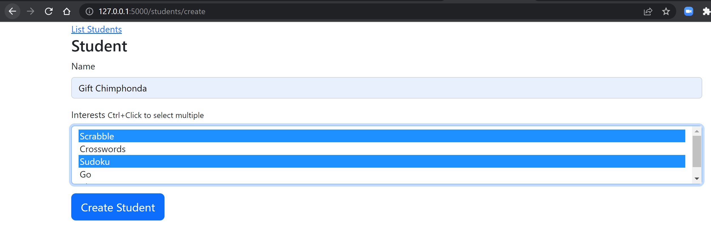
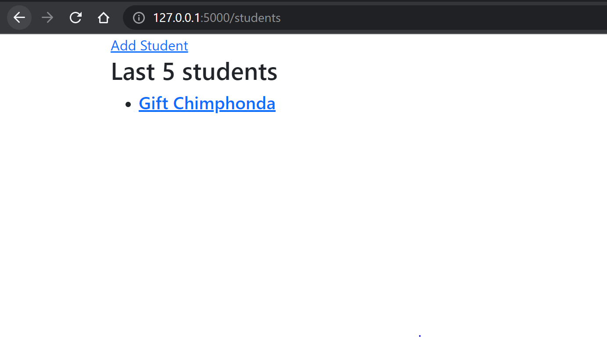

# Fyyur
Practice project for Connect Sessions.

## Installation Procedure

1. Clone the repository.
```bash
git clone https://github.com/GiftXXVI/Fyyur.git
```
sample output:
```bash
Cloning into 'Fyyur'...
remote: Enumerating objects: 1984, done.
remote: Counting objects: 100% (1984/1984), done.
remote: Compressing objects: 100% (1748/1748), done.
remote: Total 1984 (delta 172), reused 1948 (delta 141), pack-reused 0
Receiving objects: 100% (1984/1984), 9.50 MiB | 709.00 KiB/s, done.
Resolving deltas: 100% (172/172), done.
```
This creates a directory named Fyyur inside the current (working) directory.

2. Navigate into the Fyyur directory.
```bash
cd Fyyur
```
3. Create a virtualenvironment.
```bash
virtualenv venv
```
sample output:
```bash
created virtual environment CPython3.8.10.final.0-64 in 401ms
  creator CPython3Posix(dest=/home/giftxxvi/Projects/Fyyur/venv, clear=False, global=False)
  seeder FromAppData(download=False, pip=latest, setuptools=latest, wheel=latest, pkg_resources=latest, via=copy, app_data_dir=/home/giftxxvi/.local/share/virtualenv/seed-app-data/v1.0.1.debian.1)
  activators BashActivator,CShellActivator,FishActivator,PowerShellActivator,PythonActivator,XonshActivator
```
4. Activate virtualenvironment.
```bash
source venv/bin/activate
```
5. Install dependencies.
```bash
pip install -r requirements.txt
```
sample output:
```bash
Collecting alembic==1.7.7
  Using cached alembic-1.7.7-py3-none-any.whl (210 kB)
Collecting autopep8==1.6.0
  Using cached autopep8-1.6.0-py2.py3-none-any.whl (45 kB)
  ...
Collecting WTForms==3.0.1
  Using cached WTForms-3.0.1-py3-none-any.whl (136 kB)
Collecting zipp==3.8.0
  Using cached zipp-3.8.0-py3-none-any.whl (5.4 kB)
Installing collected packages: MarkupSafe, Mako, zipp, importlib-metadata, importlib-resources, greenlet, SQLAlchemy, alembic, pycodestyle, toml, autopep8, click, itsdangerous, Werkzeug, Jinja2, Flask, Flask-SQLAlchemy, Flask-Migrate, WTForms, Flask-WTF, psycopg2-binary
Successfully installed Flask-2.1.1 Flask-Migrate-3.1.0 Flask-SQLAlchemy-2.5.1 Flask-WTF-1.0.1 Jinja2-3.1.1 Mako-1.2.0 MarkupSafe-2.1.1 SQLAlchemy-1.4.35 WTForms-3.0.1 Werkzeug-2.1.1 alembic-1.7.7 autopep8-1.6.0 click-8.1.2 greenlet-1.1.2 importlib-metadata-4.11.3 importlib-resources-5.7.1 itsdangerous-2.1.2 psycopg2-binary-2.9.3 pycodestyle-2.8.0 toml-0.10.2 zipp-3.8.0
```
6. Create the database:
```bash
sudo -u postgres createdb Fyyur
```
7. Setup Environment Variables.
Before running this, make sure you have set a DB_PASSWORD and DB_NAME that match your environment's configuration.
```bash
. env.sh
```
8. Apply Migrations:
```bash
flask db upgrade
```
sample output:
```bash
INFO  [alembic.runtime.migration] Context impl PostgresqlImpl.
INFO  [alembic.runtime.migration] Will assume transactional DDL.
INFO  [alembic.runtime.migration] Running upgrade  -> b34cd64a336c, Initialize
INFO  [alembic.runtime.migration] Running upgrade b34cd64a336c -> 79a51000a838, Created Student Interests
INFO  [alembic.runtime.migration] Running upgrade 79a51000a838 -> f024e6520c3a, Corrected Foreign Key
```
9. Run the App to Test the installation.
```bash
flask run
```
sample output
```bash
 * Serving Flask app 'app' (lazy loading)
 * Environment: development
 * Debug mode: on
 * Running on http://127.0.0.1:5000 (Press CTRL+C to quit)
 * Restarting with stat
 * Debugger is active!
 * Debugger PIN: 349-051-236
```
10. Try to view and update using the following routes:

http://127.0.0.1:5000/interests  

http://127.0.0.1:5000/students  

http://127.0.0.1:5000/students/create  

http://127.0.0.1:5000/interests/create  


sample output:



